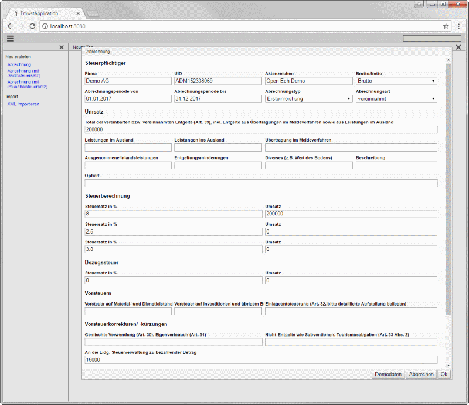

= Open-eCH: Elektronische Mehrwertsteuerabrechnung

Die Applikation richtet sich nicht an fachliche Benutzer. Das Formular zur Eingabe und Bearbeitung
einer Abrechnung enthält alle Felder die in der XML-Datei enthalten sein können, aber es werden keine
speziellen Hilfen angeboten.

Bei der Implementierung ging es mehr um die Validierung des XML-Standards von Ech. Die Umsetzung
als Java Modell und der XML - Input / Output könnte jedoch für andere Anwendungen interessant sein.

== Technische Hinweise zu der Implementierung

=== Java

Es wird Java 8 verwendet. Die neueren Features werden nicht extensiv genutzt, aber z.B. LocalDate wird verwendet.

=== Minimal-J

Die Basis der Applikation ist das Framework link:http://minimal-j.org[Minimal-J]. Minimal-J hat selber nur wenige
Abhängigkeiten, sodass das ganze Projekt aus einer übersichtlich kleinen Anzahl an Klassen besteht

=== Datenmodell

Im package ch.openech.model.emwst befinden sich die Klassen die das Datenmodell repräsentieren. Die Namen der
Klassen und der Felder entsprechen denen aus dem XML Schema des Standards.

Daher konnte das Einlesen und Schreiben der XML Files sehr einfach gehalten werden. Die entsprechenden Reader/Writer
finden sich in dem package ch.openech.xml .

=== Open-eCH

Einige Klassen werden aus der Register Applikation von Open-eCH verwendet.

=== Kontakt

Bruno Eberhard, link:mailto:bruno.eberhard@pop.ch[mailto:bruno.eberhard@pop.ch] 

== Screenshots

